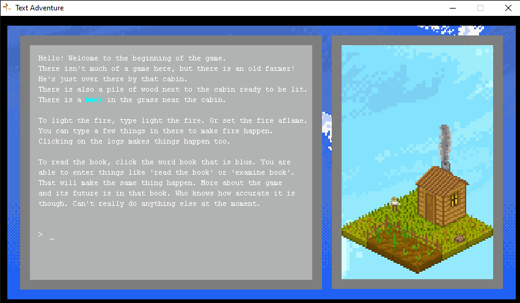
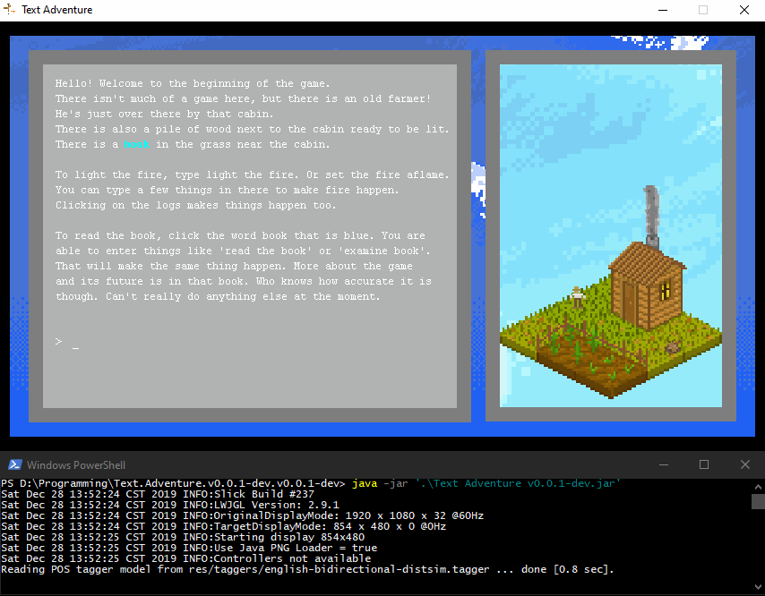

# Simple Text Adventure Prototype

## Project Description
Testing the foundation of a text adventure written in Java with Slick2D and LWJGL.

I wanted a practice project to get used to working with graphics and I wanted to create a text adventure that made entering commands natural and didn't require using reference materials whenever the player wanted to do an action. I used the Stanford Log-linear Part-Of-Speech Tagger to identify the verb and noun of sentence for commands so players unfamilar with the Interactive Fiction genre has an easier time playing the game. I also made parts of the scenery interactable so players were allows to click on objects like the fire to interact with them. Books were read from XML files so if the project got larger, books could easily be made with a separate tool and could be updated outside of Java.

## Credits

Using images from various authors on OpenGameArt.org.

A portion of an image by Kevin Chaoloux as the sky background.

I do not have permission to give out rights for any of the current art assets and all questions about them should be referred to their original authors.
